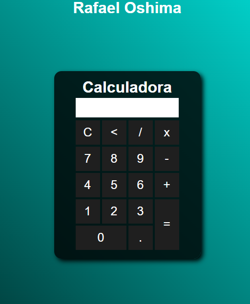

# Calculadora básica

Projeto que simula uma calculadora capaz de realizar operações aritméticas básicas, como adição, subtração, divisão e multiplicação

## 💻 Tecnologias

- HTML
- CSS
- JavaScript
- Git e GitHub

## 📩 Contato

yoshiaki_oshima@outlook.com
